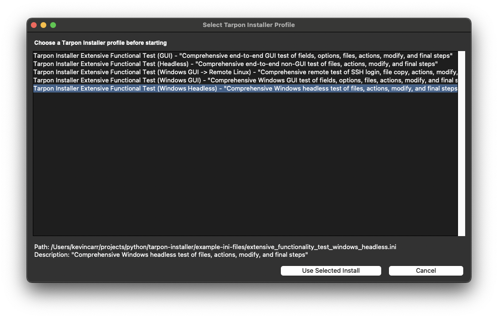

# Tarpon-Installer

Tarpon-Installer performs local and remote installs based on an INI configuration file. It supports:

- Windows to Linux remote installs
- Linux to Linux remote installs
- Local Windows installs
- Local Linux installs

I originally built it to distribute builds to Raspberry Pi devices and later used it at work for updates and general deployment tasks.

It uses a `config.ini` (name it anything you want) plus a `resources` folder.

For release history and version-to-version changes, see `CHANGELOG.md`.

## Packaging

For local packaging builds, install the runtime and build dependencies:

```bash
python3 -m pip install -r requirements.txt -r requirements-build.txt
```

### Nuitka Release Builds

Nuitka is the primary release path. Each Nuitka build creates:

- a packaged executable payload
- a release zip that contains:
  - the built executable payload
  - `assets/`
  - `example-ini-files/`
  - `sample-python-scripts/`
  - the non-build helper scripts from `useful_scripts/`

Nuitka release script:

- Linux: `useful_scripts/build_nuitka_linux.sh`
- macOS: `useful_scripts/build_nuitka_macos.sh`
- Windows: `useful_scripts/build_nuitka_windows.bat`

Each script writes a versioned release zip into `dist/nuitka/`.

GitHub Actions release artifacts are currently built for:

- Ubuntu latest `x86_64` using Nuitka `onefile`
- RHEL 8-compatible `x86_64` via UBI 8 Python 3.11 container using PyInstaller `onefile`
- RHEL 9-compatible `x86_64` via UBI 9 Python 3.11 container using PyInstaller `onefile`
- Windows `x86_64` using PyInstaller `onefile`

Release builder entrypoints:

- Nuitka release packaging: `useful_scripts/build_nuitka_release.py`
- PyInstaller release packaging: `useful_scripts/build_pyinstaller_release.py`

Recommended GitHub workflow:

1. Run the manual `build-artifacts` workflow against the branch or commit you want to validate.
2. Verify the Ubuntu, RHEL 8, RHEL 9, and Windows artifacts succeed.
3. Run the manual `release` workflow with the same ref and the matching version tag.

The `release` workflow verifies that the requested tag matches the app version in `tarpon_installer_metadata.py`, builds the release zips, and only then creates the GitHub release tag and release entry.

If the tag ends in a Python-style prerelease suffix such as `a1`, `b1`, or `rc1`, the workflow publishes the GitHub release as a pre-release automatically.

Example manual release input:

```bash
git_ref=main
tag_name=v5.0.2
```

### PyInstaller Builds

PyInstaller remains available as a fallback local build path.

Platform build scripts:

- Windows: `useful_scripts/build_pyinstaller_windows.bat`
- macOS: `useful_scripts/build_pyinstaller_macos.sh`
- Linux: `useful_scripts/build_pyinstaller_linux.sh`

Each script performs a clean build and writes a one-file executable into a platform-specific `dist/` subdirectory.

## INI Configuration

### `[STARTUP]` (GUI title, logo, and behavior)

Example:

```
usegui = True
logoimg = mylogo.png
iconpng = myicon.png
iconico = myicon.ico
installtitle = MY INSTALLER NAME GOES HERE
startupinfo = information about the installer like: "This will install MY APP on this machine"
buttontext = Install
watchdog = True
process_timeout = 180
adminrights = True
displayfinalerrors = False
continuewitherrors = False
usediagnostics = False
```

Minimal non-GUI example:

```
usegui = False
installtitle = MY NON-GUI INSTALL
startupinfo = Runs the installer without opening windows
buttontext = Run Install
watchdog = False
process_timeout = 180
adminrights = False
continuewitherrors = False
usediagnostics = False
```

Notes:

- `usegui` controls execution mode. Set `True` for the GUI or `False` for non-GUI execution.
- Non-GUI mode is configured in the INI, not by a separate `--headless` flag.
- When `usegui = False`, visual fields such as `logoimg`, `iconpng`, `iconico`, and `themename` are optional.
- `iconpng` and `iconico` are optional window/app icons. Paths are resolved relative to the current working directory unless absolute.
- `watchdog` enables the watchdog app to kill stalled processes.
- `process_timeout` controls how long local RPM installs and local actions may run before Tarpon kills the process. The default is `180` seconds. Set it to `0` to disable the timeout for long-running installers such as PostgreSQL.
- `adminrights` forces the application to run as a privileged user.
- `displayfinalerrors` shows a final scrollable GUI popup with up to the first 3 logged errors from the run. If omitted, it defaults to `False`.
- `continuewitherrors` continues per-step execution after errors in copy/modify stages when set to `True`. If omitted, it defaults to `False`.
- `usediagnostics` enables the optional `[DIAGNOSTICS]` section after `[FINAL]`. If omitted, it defaults to `False`.
- Diagnostics run for both local installs and `REMOTELINUX` installs when `[STARTUP] usediagnostics = True`.
- For `REMOTELINUX`, diagnostic commands execute on the target host over SSH and `DIAG::...` entries report pass/fail from the remote exit code.

When `usegui = False`, you can still pass `--userinput KEY=VALUE`, `--option OPTION`, and `--strict-tokens` on the command line to control the non-GUI run.
Add `--liveviewlog` if you want the non-GUI run to stream log output to the terminal while still writing the normal `.log` file.

Use `--selectinstall --selectinstalldir <directory>` to scan a specific directory tree for valid Tarpon installer INI profiles and choose one from a popup list before execution starts.

Profile selection window (`--selectinstall`):



### Command-line options (differences and usage)

Base options:

- `-t, --configfile <path>`: Run one specific INI file directly (default: `config.ini`).
- `-d, --debuglevel INFO|DEBUG`: Controls logging verbosity.
- `--version`: Prints the Tarpon Installer version and exits.

Profile discovery options:

- `--selectinstall`: Enables profile discovery mode and opens a GUI list picker before run start.
- `--selectinstalldir <dir>`: Search root used by `--selectinstall`.
- Difference: `--selectinstall` controls behavior, `--selectinstalldir` provides the search location. `--selectinstalldir` is invalid by itself.

Headless-only run-control options (`[STARTUP] usegui = False`):

- `--userinput KEY=VALUE`: Sets/overrides values from `[USERINPUT]`. Repeatable.
- `--option OPTION`: Preselects an option key from `[OPTIONS]`. Repeatable.
- `--strict-tokens`: Fails the run if unresolved `%token%` values remain.
- `--liveviewlog`: Streams log output to stdout while still writing the normal `.log` file.
- Difference: `--userinput` injects variable values, `--option` toggles optional branches/actions.

Important behavior note:

- If `[STARTUP] usegui = True`, `--userinput`, `--option`, `--strict-tokens`, and `--liveviewlog` are ignored.

### `[USERINFO]` (remote credentials)

These fields are in plaintext. They are commonly used for remote installs or to update files that require authentication. If a value is blank, the field is hidden in the GUI.
For `installtype = REMOTELINUX`, configure the remote `username` as a sudoer ahead of time.

Example:

```
username =
password =
```

### `[SERVERCONFIG]` (remote host)

Used for the remote hostname or IP address and for substitutions in other sections. `%host%` can be used as a variable. If blank, the field is hidden in the GUI.

Example:

```
host = app-server-01.example.com
```

### `[BUILD]` (platform, install type, and resources)

- `buildtype` must be `WINDOWS` or `LINUX`
- `installtype` should be `LOCAL`, `REMOTELINUX`, or `REMOTEWINDOWS`
- `resources` is the resource directory path (absolute or relative)

Example:

```
buildtype = WINDOWS
installtype = LOCAL
resources = resources\
```

Remote Windows GUI to Linux example:

```
buildtype = LINUX
installtype = REMOTELINUX
resources = .
```

`REMOTELINUX` is the current remote install mode.
`REMOTEWINDOWS` is reserved for future remote Windows support and is not implemented yet.

See `example-ini-files/extensive_functionality_test_linux_gui_remote_linux.ini` for a full remote profile.

### `[USERINPUT]` (prompted inputs)

Each key becomes a variable you can use in `[FILES]`, `[ACTIONS]`, and `[FINAL]` with `%key%`.
You can optionally provide a default by appending `|| default value`.

Example:

```
userdatafolder = Please enter data folder name || c:\userdata
databaseip = Please enter database IP address || 172.16.20.25
```

Usage:

```
%userdatafolder%
%databaseip%
```

### `[VARIABLES]` (static variables)

Example:

```
userdatafolder = c:\userdata
databaseip = 172.16.20.25
```

### `[OPTIONS]` (optional actions)

Options are displayed in the GUI and as a numbered list in console mode. Prefix your option keys with `option` so it is easy to recognize when you use them later.

Example:

```
optionmakenewdir = Do you wish to make a new directory.
optiondeleteolddata = Do you wish to delete old data?
```

Then use them in `[ACTIONS]` or `[FINAL]`:

```
optionmakenewdir = mkdir %userdatafolder%
optiondeleteolddata = rm -rf %userdatafolder%
```

### `[REPO]`

Tarpon no longer executes repo-install behavior, but keep this section present as a compatibility placeholder. It is still required for installer profile discovery/validation (`--selectinstall`).

Example:

```
[REPO]
```

### `[RPM]` (Linux RPMs)

Start with `#RPMS START HERE` and end with `#RPMS END HERE`. When used with BuildAdder, RPMs are inserted automatically if a `[RPMS]` section exists in `buildadderconfig.ini`.

Example:

```
#RPMS START HERE
installbzip2 = rpms/bzip2-libs-1.0.6-26.el8.x86_64.rpm
installapr = rpms/apr-1.6.3-12.el8.x86_64.rpm,rpms/apr-util-1.6.1-6.el8_8.1.x86_64.rpm,rpms
installhttpdfilesystem = rpms/httpd-filesystem-2.4.37-56.module+el8.8.0+1284+07ef499e.6.noarch.rpm
installhttpdtools = rpms/httpd-tools-2.4.37-56.module+el8.8.0+1284+07ef499e.6.x86_64.rpm
installhttpd = rpms/httpd-2.4.37-56.module+el8.8.0+1284+07ef499e.6.x86_64.rpm,rpms/rocky-logos-httpd-86.3-1.el8.noarch.rpm
installunzip = rpms/unzip-6.0-46.el8.x86_64.rpm
#RPMS END HERE
```

Some RPMs are grouped so dependencies are installed together.

### `[FILES]` (copy and unzip)

Start with `#BUILDS START HERE` and end with `#BUILDS END HERE`. BuildAdder can populate this section when present.

Rules:

- Missing directories are created.
- Zip files are extracted at the destination, keeping subdirectories.
- If the zip contains a single root folder, that top-level folder is ignored.

Examples:

```
#BUILDS START HERE
latestlinuxbuilds/coolfile = /opt/coolfile/folder
latestwindowsbuilds/coolfile.exe = c:\coolfile\%userfolder%
#BUILDS END HERE
anotherFolderUnderResources/thisfile.dat = c:\shouldgo\here
```

### `[ACTIONS]` (command execution)

Commands run on both Linux and Windows. Each action must have a unique key.

Examples:

```
# make sure things are executable
chmodmodifyapps = chmod 775 resources/modifyhostnames resources/modifypostgreshba
chmodactivemqdir = chmod -R 775 /opt/dcd/activemq

# Apache httpd fixups
addapacheuser = useradd apache -g apache
shutdownhttpd = systemctl stop httpd
enablehttpd = systemctl enable httpd
starthttpd = systemctl start httpd

# Windows examples
dirsupportdir = dir c:\STAR\support
createproductsfolder = mkdir c:\STAR\Products
createmanifestsfolder = mkdir c:\STAR\Products\manifests
```

### `[MODIFY]` (file edits)

Modify files using numbered entries. `{FILE}` specifies the path, `{CHANGE}` replaces a unique line using `||` as the replacement separator, and `{ADD}` appends to the file (creating it if missing).

Examples:

```
1 = {FILE}C:/myinstall/support/userconfig.conf{CHANGE}user1 =||user1 = Marky
2 = {FILE}C:/myinstall/support/userconfig.conf{CHANGE}log_timezone =||log_timezone = 'UTC'
3 = {FILE}C:/myinstall/support/userconfig.conf{ADD}portnumber = 55001
4 = {FILE}C:/myinstall/support/userconfig.conf{ADD} # Muskrats Stink
5 = {FILE}C:/myinstall/support/createthisfile.conf{ADD}ipaddress = 111.222.333.444||portnumber = 34333||resourcefolder = d:\resources
```

### `[FINAL]` (last actions)

Same format as `[ACTIONS]`, but executed last.

### `[DIAGNOSTICS]` (post-final checks and follow-up commands)

This section runs after `[FINAL]` when `[STARTUP] usediagnostics = True`.
For `REMOTELINUX`, commands in this section execute on the target host over SSH.

It supports two kinds of entries:

- diagnostic result entries using `DIAG::display text::command`
- normal action-style commands such as `echo`, `timeout`, or TarpL entries like `YESNO::...::...`

`DIAG::...` entries execute the command and report:

- `[PASS]` when the command returns `0`
- `[FAILED]` when the command returns a nonzero exit code

In GUI mode, diagnostics results are shown in a popup with green and red status indicators.
In headless mode, the same results are printed to the terminal/log after the run.

Example:

```
[DIAGNOSTICS]
checkactivemqserver = DIAG::Checking ActiveMQ::sc query ActiveMQ
rebootmachine = echo "********* FINISHED  *********"
starttimer = timeout /t 10
shutitdown = YESNO::"Do you wish to restart now?"::shutdown /r
rebootmachine1 = echo "********* BYE *********"
```

Examples:

```
statusjaardcm = systemctl status stardcm | grep Active:
statusjaarwcm = systemctl status activemq | grep Active:
rebootmachine = echo "********* FINISHED AND REBOOTING IN 10 SECONDS *********"
starttimer = timeout /t 10
shutitdown = shutdown /r
```

---

## TarpL (Tarpon Language)

TarpL is Tarpon Installer's inline command language for prompts, branching, option-driven behavior, and Python callbacks inside `[OPTIONS]`, `[ACTIONS]`, and `[FINAL]`.

Use the examples below as a reference for the supported TarpL forms and their syntax.

### `YESNO`

Prompts the user with a yes/no question and runs the action if yes.

Syntax:

```
YESNO::prompt::action
```

Example:

```
rebootornot = YESNO::Do you want to reboot your system now?::echo "## - rebooting in 10 seconds ##"; sleep 10; reboot
```

### `MSGBOX`

Shows a message dialog in the GUI or prints a message in console mode.

Note:

- `MSGBOX` is the correct way to deliberately show a user-facing message.
- `echo` is still just a normal shell command. It does not become a TarpL keyword or popup/message prompt.
- In headless mode, `MSGBOX` prints a framed message and pauses for Enter. `echo` only appears as command output if it is logged or live-viewed.

Syntax:

```
MSGBOX::string to display
```

Example:

```
popupmessagetouser1 = MSGBOX::Please make sure this %hostIP% is the correct IP address.
```

### `[IF][THEN][ELSE]`

Evaluates a simple condition and executes either the `[THEN]` or `[ELSE]` branch.

Supported operators:

- `==`
- `!=`
- `contains`

Syntax:

```
[IF]left_condition[THEN]action_if_true[ELSE]action_if_false
```

Example:

```
checkipaddress = [IF]%host% == 127.0.0.1[THEN]MSGBOX::You are using localhost[ELSE]MSGBOX::You are not using localhost
```

### `POPLIST`

Populates a list from a comma-delimited string or file and stores the selection in a variable.

Syntax:

```
POPLIST::message::INPUTFILE::<filename>
POPLIST::message::INPUTLIST::"one,two,three,four"
```

Examples:

```
getusernames1 = POPLIST::Please choose a username::INPUTFILE::c:\path\usernames.txt::getusernamesfilevariable
getusernames2 = POPLIST::Please choose a username::INPUTLIST::"JAMES, FRED, MARY, JOHN"::getusernameslistvariable

dothisactionnext1 = MSGBOX "You chose %getusernamesfilevariable%"
dothisactionnext2 = MSGBOX "You chose %getusernameslistvariable%"
```

### `IFGOTO`

Jumps to an INI index name based on a command exit code. If the command returns `0`, the jump occurs.

Syntax:

```
IFGOTO::command that returns 0 or 1::indexname
```

Examples:

```
checklinuxuserdirectory = IFGOTO::[ -d "/usr/bin" ]; exit $?::iniindexnameyouwanttojumpto
checkwindowsdirectory = IFGOTO::IF EXIST "C:\Windows" (cmd /c exit 0) ELSE (cmd /c exit 1) & cmd /c exit %ERRORLEVEL%::iniindexnameyouwanttojumpto
```

### `IFOPTION`

Executes the action only if the option was selected.

Syntax:

```
IFOPTION::optionname::action
```

Examples:

```
ifoptiontest1 = IFOPTION::optionpopupmessagelater::echo optionpopupmessagelater must have been checked
ifoptiontest2 = IFOPTION::optionmakeadirectory::echo optionmakeadirectory must have been checked
ifoptiontest3 = IFOPTION::optionporkythepig::echo optionporkythepig must have been checked
```

### `ALSOCHECKOPTION`

Automatically selects another option when an option is chosen.

Syntax:

```
ALSOCHECKOPTION::option_to_select::description
```

Examples:

```
optionmakeadirectory = ALSOCHECKOPTION::optionpopupmessagelater::Create a directory in your home folder
optionpopupmessagelater = Popup a message to you later
```

### `DEFAULTCHECKED`

Marks an option as selected by default when the options dialog opens, and in
headless mode it enables the option even when `--option` is not passed.

Syntax:

```
DEFAULTCHECKED::description
```

Examples:

```
optionshowdiagnostics = DEFAULTCHECKED::Show diagnostics after install
```

`DEFAULTCHECKED` can be combined with `ALSOCHECKOPTION` in either order. When
combined, the default-checked option also enables the dependent options.

Examples:

```
optionprepareworkspace = DEFAULTCHECKED::ALSOCHECKOPTION::optionshowsummary,optionexecpython::Prepare workspace
optionprepareworkspace_alt = ALSOCHECKOPTION::optionshowsummary,optionexecpython::DEFAULTCHECKED::Prepare workspace
```

### `EXEC_PYFUNC`

Runs a function from a Python file, even if Python is not installed. Only string parameters are supported.

Syntax:

```
EXEC_PYFUNC::folder\pythonfile.py::function_name::param1,param2,param3
```

Example:

```
executepython = EXEC_PYFUNC::sample-python-scripts\reminder.py::popup_message::"I Forgot","To Eat","Breakfast"
```

## Final Notes

Tarpon-Installer is a work in progress and in active use. More example `installer.ini` files will be added over time.

Thanks,
Kevin Carr
