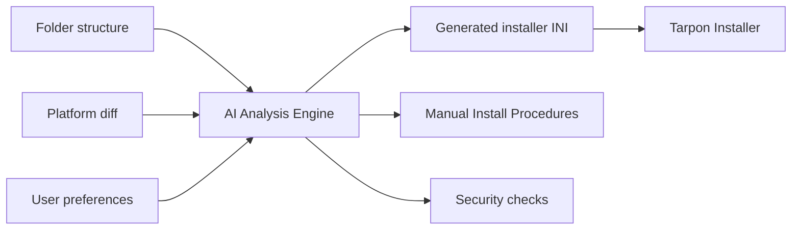
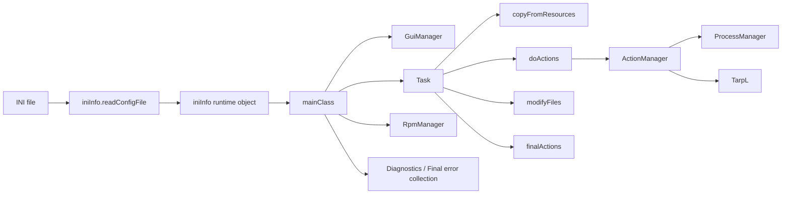

<div class="grid grid-cols-[1.25fr_0.75fr] gap-10 items-center h-full">
  <div>
    <div class="eyebrow">Developer Overview</div>
    <h1 class="!mb-4">Tarpon Installer</h1>
    <p class="text-xl opacity-85 !leading-8">
      A single deployment framework for repeatable installs, updates, and environment setup across Windows and Linux workflows.
    </p>
    <div class="mt-8 grid grid-cols-2 gap-4 text-sm">
      <div class="feature-card">
        <div class="eyebrow">What It Replaces</div>
        One-off scripts, manual copy steps, and custom installer rewrites.
      </div>
      <div class="feature-card">
        <div class="eyebrow">What It Uses</div>
        A config file, a resources folder, and a single packaged executable.
      </div>
      <div class="feature-card">
        <div class="eyebrow">Who It Helps</div>
        Operators, support staff, release owners, and deployment engineers.
      </div>
      <div class="feature-card">
        <div class="eyebrow">Current Version</div>
        `v5.0.3b2`
      </div>
    </div>
  </div>
  <div class="flex items-center justify-center">
    <div class="brand-panel">
      
      <div class="mt-5 text-center text-sm opacity-70">
        Tarpon Installer branding asset served from the Slidev deck
      </div>
    </div>
  </div>
</div>

---
layout: section
---

# Overview

---
layout: two-cols
layoutClass: gap-12
---

# What Tarpon Installer can do today

- Windows to Linux remote installs
- Linux to Linux remote installs
- Local Windows installs
- Local Linux installs
- GUI-driven installs for operators
- Headless runs for automation and scripted use
- Release packaging for Linux, RHEL, macOS, and Windows

::right::

# Why that matters

- One deployment approach can cover multiple product environments
- Operator steps move out of tribal knowledge and into config
- File copies, commands, prompts, and config edits stay in one tool
- Release packaging stays tied to the same repository and version line

---

# Business value

<div class="grid grid-cols-3 gap-4 mt-8 text-sm">
  <div class="feature-card">
    <div class="eyebrow">Consistency</div>
    Standardizes installs so each environment does not require a different delivery method.
  </div>
  <div class="feature-card">
    <div class="eyebrow">Speed</div>
    Reduces repeated manual setup work during upgrades and new deployments.
  </div>
  <div class="feature-card">
    <div class="eyebrow">Control</div>
    Keeps prompts, actions, and file changes visible in one configuration model.
  </div>
  <div class="feature-card">
    <div class="eyebrow">Lower Scripting Burden</div>
    Teams do not need to master a full scripting language for many deployment cases. They mainly need to know the OS commands they want Tarpon Installer to execute.
  </div>
  <div class="feature-card">
    <div class="eyebrow">Supportability</div>
    Adds logging, diagnostics, timeouts, and error summaries for real operational use.
  </div>
  <div class="feature-card">
    <div class="eyebrow">Build Integration</div>
    `buildadder.py` can automatically inject the latest build artifacts into the installer INI from a builder `.ini`, which fits cleanly into Jenkins or GitLab pipelines.
  </div>
</div>

---
layout: two-cols
layoutClass: gap-10
---

# Operator workflow

1. Choose the installer configuration.
2. Launch in GUI or headless mode.
3. Provide any runtime inputs or options.
4. Let Tarpon copy files, run commands, and modify configs.
5. Review final status, diagnostics, and any collected errors.

::right::

# What teams configure

- installer title and branding
- target host and credentials
- resources location
- user prompts
- optional actions
- files to copy
- commands to run
- files to modify
- final checks and diagnostics

---
---

# What it orchestrates

<div class="grid grid-cols-4 gap-3 mt-6 text-sm">
  <div class="pipeline-step">FILES</div>
  <div class="pipeline-step">ACTIONS</div>
  <div class="pipeline-step">MODIFY</div>
  <div class="pipeline-step">FINAL</div>
</div>

<div class="grid grid-cols-1 gap-3 mt-3 text-sm">
  <div class="pipeline-step">DIAGNOSTICS</div>
</div>

<div class="grid grid-cols-2 gap-3 mt-6 text-sm leading-6">
  <div class="feature-card">
    <div class="eyebrow">Files</div>
    Copy resources, create missing directories, and unzip build payloads to target locations.
  </div>
  <div class="feature-card">
    <div class="eyebrow">Actions</div>
    Run Windows or Linux commands in the intended install sequence.
  </div>
  <div class="feature-card">
    <div class="eyebrow">Modify</div>
    Replace unique lines or append content in deployed configuration files.
  </div>
  <div class="feature-card">
    <div class="eyebrow">Final</div>
    Execute last-step checks, reboot messaging, or service validation.
  </div>
  <div class="feature-card">
    <div class="eyebrow">Diagnostics</div>
    Run post-install validation checks to confirm expected files, directories, and outcomes.
  </div>
</div>

---
layout: two-cols
layoutClass: gap-10
---

# Reliability and visibility

- `watchdog` support for stalled local processes
- configurable process timeouts
- optional final error summary dialog
- optional diagnostics section after install
- headless live log streaming with `--liveviewlog`

::right::

# Practical result

- fewer silent failures
- easier support handoff
- easier validation after deploy
- better operator confidence during long-running installs
- stronger fit for real-world deployment operations

<div class="mt-6 rounded-2xl bg-white/70 px-5 py-4 text-sm shadow">
Diagnostics are not just logging. The installer can run a dedicated `[DIAGNOSTICS]` section after the main install to verify expected files or directories and report the results back to the operator.
</div>

---
layout: two-cols
layoutClass: gap-10
---

# Input experience

```ini
[USERINPUT]
operator_name = Enter operator name || kevin
customer_name = Enter customer shortname || acme
environment = Enter environment (dev, qa, prod) || qa
port_value = Enter service port || 8080
```

::right::

# Developer takeaway

- prompts can be pre-seeded with sensible defaults
- operators move faster with fewer typing mistakes
- the same installer can be reused for multiple customers or sites
- defaults still allow overrides when a deployment differs
- this works in GUI and non-GUI runs

---
layout: two-cols
layoutClass: gap-10
---

# File modification is built in

```ini
[MODIFY]
1 = {FILE}%stagedir%/generated.conf{ADD}customer=%customer_name%||env=%environment%
2 = {FILE}%stagedir%/config.txt{CHANGE}line2=beta||line2=%selected_file_value%
3 = {FILE}%stagedir%/config.txt{ADD}role=%selected_role%
```

::right::

# Why this matters

- deployed files can be tailored at install time
- site-specific values do not require rebuilding the product
- follow-up scripts and manual edits are reduced
- customer, environment, ports, and role values can be stamped directly into config files

---
layout: two-cols
layoutClass: gap-10
---

# Diagnostics example

```ini
[DIAGNOSTICS]
check_stagedir = DIAG::Checking stagedir exists::test -d %stagedir%/%customer_name%/%environment%
check_config = DIAG::Checking config file exists::test -f %stagedir%/%customer_name%/%environment%/config.txt
diag_banner = echo Diagnostics finished for %customer_name%
```

::right::

# Business value of diagnostics

- confirms that the install produced the expected artifacts
- gives support staff a clear post-run validation step
- reduces “it installed but did it really work?” ambiguity
- fits naturally into customer acceptance or handoff workflows

---
layout: two-cols
layoutClass: gap-10
---

# How `[DIAGNOSTICS]` works

```ini
[DIAGNOSTICS]
check_stagedir = DIAG::Checking stagedir exists::test -d %stagedir%/%customer_name%/%environment%
check_config = DIAG::Checking config file exists::test -f %stagedir%/%customer_name%/%environment%/config.txt
diag_banner = echo Diagnostics finished for %customer_name%
```

::right::

# What happens at runtime

1. Tarpon Installer finishes the normal install flow first.
2. If `usediagnostics = True`, it enters the `[DIAGNOSTICS]` section.
3. Each `DIAG::label::command` entry runs a validation command.
4. The command exit status determines pass or fail.
5. Results are shown back to the operator in a diagnostics dialog.

<div class="mt-4 text-sm opacity-80">
This makes diagnostics a post-install verification phase, not just extra logging. Typical checks confirm files, folders, services, or other expected outcomes.
</div>

---
layout: two-cols
layoutClass: gap-10
---

# Good diagnostics patterns

- verify a staged directory exists
- verify a config file was created
- verify a service file or binary landed in the expected path
- verify platform-specific prerequisites after install
- keep each diagnostic focused on one clear expected outcome

::right::

# Example use cases

- customer acceptance check after a guided install
- support validation before handing a machine back
- post-upgrade smoke checks
- scripted quality gates in a repeatable deployment process

<div class="mt-4 text-sm">
The key idea is simple: installation performs the work, diagnostics prove the result.
</div>

---
layout: two-cols
layoutClass: gap-8 items-center startup-slide
---

# Startup experience


::right::

# What this screenshot demonstrates

- branded startup experience
- guided operator workflow
- `USERINPUT` defaults already populated
- progress panel visible before execution
- a single entry point for install execution
- values come directly from the extensive functional GUI profile

<div class="mt-4 text-sm opacity-80">
Source profiles:
`example-ini-files/extensive_functionality_test_gui.ini`
`example-ini-files/extensive_functionality_test_windows_gui.ini`
</div>

<div class="mt-3 text-sm opacity-80">
These profiles are intentionally broad and non-destructive, which makes them good demo material for the presentation.
</div>

---
layout: two-cols
layoutClass: gap-10 items-center
---

# Options and dependent choices


::right::

# What this shows

- one installer can expose optional behaviors without extra scripts
- operators can choose install-time variations from the UI
- `ALSOCHECKOPTION` automatically selects dependent options
- related tasks can be bundled behind one visible choice

<div class="mt-4 text-sm">
This screenshot shows `Prepare workspace` automatically checking other related options, which is exactly the kind of dependency handling `ALSOCHECKOPTION` was designed for.
</div>

---
layout: two-cols
layoutClass: gap-10 items-center
---

# Controlled selection with POPLIST


::right::

# What this shows

- `POPLIST` presents a controlled set of choices
- choices can come from an inline comma-separated list
- choices can also come from a file such as a CSV/text source
- role, site, and environment selections can be guided
- free-form typing is reduced
- later actions can reuse the selected value directly

<div class="mt-4 text-sm">
`POPLIST` reduces free-form typing by letting the installer present a controlled list of valid choices such as roles, sites, or environments, whether those values are written inline or read from a file.
</div>

---
layout: two-cols
layoutClass: gap-10 items-center
---

# Diagnostics in action


::right::

# What this shows

- post-install validation results
- pass/fail style feedback for operators
- confirmation that staged files were created
- a clean handoff point for support or QA review

<div class="mt-4 text-sm">
This is the post-install diagnostics dialog confirming that expected artifacts exist after the run.
</div>

---
layout: two-cols
layoutClass: gap-10 items-center
---

# Final error summary


::right::

# What this shows

- final error collection at the end of a run
- immediate visibility into failed commands
- faster support triage
- clearer operator feedback than searching logs first

<div class="mt-4 text-sm">
When enabled, Tarpon Installer can show a final scrollable summary of captured errors so operators and support staff have immediate feedback.
</div>

---
layout: section
---

# TarpL Overview

---
layout: two-cols
layoutClass: gap-10
---

# What TarpL is

TarpL, the Tarpon Language, is the inline rules layer that lets an installer do more than copy files and run commands.

- prompts users
- branches based on values
- reacts to options
- jumps to alternate flow points
- calls packaged Python functions

::right::

# Why it matters

- more behavior can stay in config
- less custom code is needed per installer
- operators get guided interaction
- complex flows remain readable in the INI

---
layout: two-cols
layoutClass: gap-10
---

# `YESNO`

Asks the operator a yes/no question and only runs the action if the answer is yes.

```ini
rebootornot = YESNO::Do you want to reboot your system now?::echo rebooting in 10 seconds
```

::right::

# Common usage

- confirm a risky step
- ask before rebooting
- ask before deleting or replacing data
- let the same installer support cautious and fast paths

---
layout: two-cols
layoutClass: gap-10
---

# `MSGBOX`

Shows a user-facing message in the GUI, or prints it in console mode.

```ini
popupmessagetouser1 = MSGBOX "Please make sure this %hostIP% is the correct IP address."
```

::right::

# Common usage

- show instructions
- show warnings
- confirm selections
- communicate install milestones without shell noise

---
layout: two-cols
layoutClass: gap-10
---

# `[IF][THEN][ELSE]`

Evaluates a simple condition and chooses one branch.

```ini
checkipaddress = [IF]%host% == 127.0.0.1[THEN]MSGBOX::You are using localhost[ELSE]MSGBOX::You are not using localhost
```

::right::

# Common usage

- vary behavior by environment
- warn when a target looks suspicious
- show different messages for dev, qa, and prod
- keep branching in config instead of scripts

---
layout: two-cols
layoutClass: gap-10
---

# `POPLIST`

Prompts the user to choose from a list of values, either inline or from a file.

```ini
getusernames2 = POPLIST::Please choose a username::INPUTLIST::"JAMES,FRED,MARY,JOHN"::selected_user
```

```ini
getusernames1 = POPLIST::Please choose a username::INPUTFILE::c:\path\usernames.txt::selected_user
```

::right::

# Common usage

- choose a customer, role, or site
- reduce free-form typing
- drive later actions from one guided selection
- reuse allowed values from a data file

---
layout: two-cols
layoutClass: gap-10
---

# `IFGOTO`

Runs a check and jumps to another named action when it succeeds.

```ini
checklinuxuserdirectory = IFGOTO::[ -d "/usr/bin" ]; exit $?::iniindexnameyouwanttojumpto
```

::right::

# Common usage

- skip steps when prerequisites already exist
- route around unnecessary work
- create fast-path install flows
- reduce duplicate steps for already-prepared machines

---
layout: two-cols
layoutClass: gap-10
---

# `IFOPTION`

Runs an action only if a named option was selected.

```ini
ifoptiontest1 = IFOPTION::optionpopupmessagelater::echo optionpopupmessagelater must have been checked
```

::right::

# Common usage

- optional features stay optional
- one installer can support multiple install variants
- selected options can trigger only the relevant actions

---
layout: two-cols
layoutClass: gap-10
---

# `ALSOCHECKOPTION`

Automatically selects another option when one option is chosen.

```ini
optionmakeadirectory = ALSOCHECKOPTION::optionpopupmessagelater::Create a directory in your home folder
```

::right::

# Common usage

- enforce dependent choices
- simplify the operator decision tree
- prevent invalid option combinations
- make bundled install selections easier

---
layout: two-cols
layoutClass: gap-10
---

# `EXEC_PYFUNC`

Calls a function from a Python file with string parameters.

```ini
executepython = EXEC_PYFUNC::sample-python-scripts\reminder.py::popup_message::"I Forgot","To Eat","Breakfast"
```

::right::

# Common usage

- reuse specialized logic without rewriting the installer
- attach custom callbacks to key milestones
- bridge config-driven workflows with small targeted Python helpers

---
layout: two-cols
layoutClass: gap-10
---

# TarpL summary

- `YESNO`: operator confirmation
- `MSGBOX`: guided messaging
- `[IF][THEN][ELSE]`: conditional branching
- `POPLIST`: controlled selection
- `IFGOTO`: flow jumping
- `IFOPTION`: option-gated behavior
- `ALSOCHECKOPTION`: dependent option selection
- `EXEC_PYFUNC`: custom callback execution

::right::

# Developer takeaway

TarpL turns Tarpon Installer from a static installer into a guided workflow engine while still keeping most of the behavior in configuration.

---

# Release readiness

<div class="grid grid-cols-2 gap-4 mt-8">
  <div class="feature-card">
    <div class="eyebrow">Linux</div>
    `x86_64` release artifacts built with Nuitka `onefile`.
  </div>
  <div class="feature-card">
    <div class="eyebrow">Windows</div>
    `x86_64` release artifacts built with PyInstaller `onefile`.
  </div>
  <div class="feature-card">
    <div class="eyebrow">RHEL</div>
    RHEL 8 and RHEL 9 artifacts built with PyInstaller `onefile`.
  </div>
  <div class="feature-card">
    <div class="eyebrow">Workflow</div>
    Manual artifact validation and release workflows stay tied to repo versioning.
  </div>
</div>

<div class="mt-6 text-sm opacity-80">
Pre-release tags such as `aN`, `bN`, and `rcN` publish as GitHub pre-releases.
</div>

<div class="mt-4 rounded-2xl bg-white/70 px-5 py-4 text-sm shadow">
Build preparation can also be automated with `buildadder.py` in `tarpon_utility_apps/`, which reads a builder `.ini` file, finds the latest matching files under `resources/`, and populates the installer INI automatically. That makes Tarpon Installer easier to wire into build systems such as Jenkins or GitLab.
</div>

---
layout: two-cols
layoutClass: gap-12 items-center
---

# Tarpon Maker

## Up and coming product

### AI-assisted installer generation built on top of Tarpon Installer

- automatically generate installer `.ini` files
- learn from folder structure, build contents, and user preferences
- compare baseline installs to infer what changed
- add security review and procedure documentation generation

::right::



<div class="mt-4 text-sm opacity-80">
Conceptually: AI feeds Tarpon Installer with generated installer logic, while also producing review and documentation outputs around the install.
</div>

---
layout: two-cols
layoutClass: gap-10
---

# What Tarpon Maker is

Tarpon Maker is the next product direction built on top of Tarpon Installer technology.

- uses the Tarpon Installer model as its foundation
- adds AI-assisted installer creation
- focuses on reducing manual authoring effort
- aims to move from installer framework to installer generation platform

::right::

# Core vision

- generate installer `.ini` files automatically
- learn from folder structures and file layouts
- adapt to user preferences and deployment intent
- accelerate the path from “working install” to “repeatable installer”

---
layout: two-cols
layoutClass: gap-10
---

# AI-assisted installer generation

- inspect folder structures under a build
- recognize common payload and support file patterns
- suggest or generate `[FILES]`, `[ACTIONS]`, and related sections
- use user preferences to tailor install behavior and defaults

::right::

# Why that matters

- less hand-written installer authoring
- faster onboarding for new deployment packages
- more consistency across teams
- easier reuse of proven install patterns

<div class="mt-4 text-sm">
The goal is to let teams describe what they have and what they want, then let the product produce a strong first-pass installer automatically.
</div>

---
layout: two-cols
layoutClass: gap-10
---

# AI from base-install comparison

- inspect a clean platform baseline
- inspect the platform after a target product install
- evaluate the differences between the two states
- infer what was added, changed, configured, or enabled

::right::

# Resulting capability

- determine what an install actually did
- translate those differences into installer logic
- create a repeatable Tarpon-style installer from an observed manual install
- turn tribal deployment knowledge into reproducible automation

---
layout: two-cols
layoutClass: gap-10
---

# Security and compliance direction

- perform security-oriented checks against the installed result
- identify risky file, service, or configuration outcomes
- support review of what was deployed and changed
- help teams package installation work more responsibly

::right::

# Documentation generation

- produce Manual Install Procedures documentation
- turn install behavior into supportable written steps
- help teams satisfy documentation-heavy environments
- support DOD-style operational and compliance expectations

<div class="mt-4 text-sm">
This moves the product beyond installation and into the full lifecycle of build understanding, security review, and procedural documentation.
</div>

---
layout: two-cols
layoutClass: gap-10
---

# Tarpon Maker summary

1. Start with Tarpon Installer’s proven execution model.
2. Add AI to create installer definitions from real software layouts and deployment intent.
3. Learn from platform before-and-after comparisons to infer install behavior.
4. Layer in security checks and DOD-oriented manual procedure generation.

::right::

<div class="feature-card mt-12">
  <div class="eyebrow">Positioning</div>
  Tarpon Installer is the execution engine. Tarpon Maker is the intelligence layer that can help create, analyze, secure, and document installers built on that engine.
</div>

---

# Bottom line

1. Tarpon Installer already acts as a deployment platform, not just a wrapper around copy commands.
2. It reduces repeated install effort while improving consistency and operator control.
3. It supports current release packaging across the key target platforms in this repo.
4. It can satisfy both non-technical operators and technical deployment owners with the same tool.

<div class="mt-10 rounded-2xl bg-[#11253d] px-6 py-4 text-white">
If the audience only needs the business message, the presentation can stop here.
</div>

---
layout: section
---

# Technical Appendix

---
layout: two-cols
layoutClass: gap-12
---

# Runtime architecture



::right::

# Core modules

- [tarpon_installer.py](/Users/kevincarr/projects/python/tarpon-installer/tarpon_installer.py)
- [iniinfo.py](/Users/kevincarr/projects/python/tarpon-installer/iniinfo.py)
- [task.py](/Users/kevincarr/projects/python/tarpon-installer/task.py)
- [managers/actionmanager.py](/Users/kevincarr/projects/python/tarpon-installer/managers/actionmanager.py)
- [managers/processmanager.py](/Users/kevincarr/projects/python/tarpon-installer/managers/processmanager.py)
- [managers/guimanager.py](/Users/kevincarr/projects/python/tarpon-installer/managers/guimanager.py)
- [tarpl/tarplapi.py](/Users/kevincarr/projects/python/tarpon-installer/tarpl/tarplapi.py)

---
layout: two-cols
layoutClass: gap-10
---

# Config model and parsing

```py
self.usegui = config_object.getboolean("STARTUP", "usegui")
self.watchdog = config_object.getboolean("STARTUP", "watchdog")
self.process_timeout = self._parse_process_timeout(
    startup.get("process_timeout", "180")
)
self.displayfinalerrors = startup.get(
    "displayfinalerrors", ""
).strip().lower() in {"1", "true", "yes", "on"}
self.usediagnostics = startup.get(
    "usediagnostics", ""
).strip().lower() in {"1", "true", "yes", "on"}
```

::right::

# Major sections

- `[STARTUP]`
- `[USERINFO]`
- `[SERVERCONFIG]`
- `[BUILD]`
- `[USERINPUT]`
- `[VARIABLES]`
- `[OPTIONS]`
- `[RPM]`
- `[FILES]`
- `[ACTIONS]`
- `[MODIFY]`
- `[FINAL]`
- `[DIAGNOSTICS]`

---
layout: two-cols
layoutClass: gap-10
---

# Execution pipeline

```py
if ini_info.buildtype == 'LINUX':
    self.rpm_manager.installLocalRPMs(...)

task.copyFromResources(...)
task.doActions(...)
task.modifyFiles(...)
task.finalActions(...)

if ini_info.usediagnostics:
    diagnostics = task.runDiagnostics(...)
```

::right::

# CLI and automation surface

```bash
python tarpon_installer.py \
  --configfile installer.ini \
  --userinput databaseip=172.16.20.25 \
  --option optiondeleteolddata \
  --strict-tokens \
  --liveviewlog
```

---
layout: two-cols
layoutClass: gap-10
---

# TarpL capability layer

- `YESNO`
- `MSGBOX`
- `[IF][THEN][ELSE]`
- `POPLIST`
- `IFGOTO`
- `IFOPTION`
- `ALSOCHECKOPTION`
- `EXEC_PYFUNC`

::right::

```ini
checkipaddress =
  [IF]%host% == 127.0.0.1
  [THEN]MSGBOX::You are using localhost
  [ELSE]MSGBOX::You are not using localhost

executepython =
  EXEC_PYFUNC::sample-python-scripts\reminder.py
  ::popup_message
  ::"I Forgot","To Eat","Breakfast"
```

---
layout: center
class: text-center
---

# Questions

### Overview first, technical appendix second

<div class="mt-8 text-sm opacity-70">
Deck source: `documents/Tarpon Installer/slides.md`
</div>

<style>
:root {
  --slidev-theme-primary: #0b5f7a;
}

.slidev-layout {
  background:
    radial-gradient(circle at top left, rgba(188, 226, 255, 0.25), transparent 32%),
    linear-gradient(135deg, #f4efe4 0%, #f8fbff 50%, #eef4ea 100%);
  color: #1b2430;
}

h1,
h2,
h3,
h4 {
  color: #10263a;
}

h1 {
  letter-spacing: -0.03em;
}

.feature-card {
  border: 1px solid rgba(16, 38, 58, 0.12);
  border-radius: 1rem;
  padding: 1rem;
  background: rgba(255, 255, 255, 0.72);
  box-shadow: 0 12px 30px rgba(16, 38, 58, 0.08);
}

.eyebrow {
  text-transform: uppercase;
  letter-spacing: 0.12em;
  font-size: 0.7rem;
  color: #0b5f7a;
  margin-bottom: 0.35rem;
  font-weight: 700;
}

.slidev-layout.section {
  background:
    linear-gradient(135deg, rgba(11, 95, 122, 0.92), rgba(11, 52, 89, 0.92)),
    linear-gradient(135deg, #0b5f7a 0%, #113459 100%);
  color: #f8fbff;
}

.slidev-layout.section h1 {
  color: #f8fbff;
  font-size: 3rem;
}

.brand-panel {
  background: linear-gradient(180deg, rgba(255,255,255,0.9), rgba(232,241,247,0.9));
  border: 1px solid rgba(16, 38, 58, 0.12);
  border-radius: 1.5rem;
  padding: 1.5rem;
  width: 100%;
  box-shadow: 0 18px 36px rgba(16, 38, 58, 0.12);
}

.brand-logo {
  width: 100%;
  max-width: 320px;
  margin: 0 auto;
  display: block;
}

.shot-lg {
  width: 100%;
  max-width: 1100px;
  margin: 0 auto;
  display: block;
  border-radius: 1rem;
  box-shadow: 0 18px 36px rgba(16, 38, 58, 0.18);
  border: 1px solid rgba(16, 38, 58, 0.12);
}

.shot-md {
  width: 100%;
  max-width: 760px;
  margin: 0 auto;
  display: block;
  border-radius: 1rem;
  box-shadow: 0 18px 36px rgba(16, 38, 58, 0.18);
  border: 1px solid rgba(16, 38, 58, 0.12);
}

.shot-hero {
  width: 100%;
  max-width: 1180px;
  max-height: 76vh;
  margin: 0 auto;
  display: block;
  object-fit: contain;
  border-radius: 1rem;
  box-shadow: 0 18px 36px rgba(16, 38, 58, 0.18);
  border: 1px solid rgba(16, 38, 58, 0.12);
}

.shot-panel {
  width: 100%;
  max-width: 720px;
  max-height: 68vh;
  margin: 0 auto;
  display: block;
  object-fit: contain;
  border-radius: 1rem;
  box-shadow: 0 18px 36px rgba(16, 38, 58, 0.18);
  border: 1px solid rgba(16, 38, 58, 0.12);
}

.shot-panel-startup {
  max-width: 980px;
  max-height: 78vh;
}

.startup-slide {
  grid-template-columns: 1.2fr 0.8fr;
}

.shot-panel-narrow {
  max-width: 560px;
}

.pipeline-step {
  border-radius: 999px;
  padding: 0.75rem 1rem;
  text-align: center;
  font-weight: 700;
  background: #10263a;
  color: white;
  box-shadow: 0 10px 24px rgba(16, 38, 58, 0.12);
}

.slidev-layout.tarpon-maker-hero {
  background:
    radial-gradient(circle at 18% 20%, rgba(90, 196, 255, 0.22), transparent 24%),
    radial-gradient(circle at 82% 30%, rgba(72, 255, 179, 0.16), transparent 22%),
    linear-gradient(135deg, #091722 0%, #0d2438 45%, #15304a 100%);
  color: #eef7ff;
}

.slidev-layout.tarpon-maker-hero h1 {
  color: #f7fbff;
}

.maker-hero {
  height: 100%;
  display: grid;
  grid-template-columns: 1.05fr 0.95fr;
  gap: 2.5rem;
  align-items: center;
}

.maker-kicker {
  color: #77d5ff;
}

.maker-title {
  font-size: 4.8rem;
  line-height: 0.95;
  margin: 0;
  letter-spacing: -0.05em;
}

.maker-subtitle {
  margin-top: 1rem;
  font-size: 1.45rem;
  line-height: 1.45;
  max-width: 34rem;
  color: rgba(238, 247, 255, 0.88);
}

.maker-pill-row {
  margin-top: 2rem;
  display: flex;
  flex-wrap: wrap;
  gap: 0.75rem;
}

.maker-pill {
  padding: 0.7rem 1rem;
  border-radius: 999px;
  background: rgba(255, 255, 255, 0.08);
  border: 1px solid rgba(119, 213, 255, 0.24);
  font-size: 0.95rem;
  color: #eef7ff;
}

.maker-visual {
  display: grid;
  grid-template-columns: 1fr auto 1fr;
  align-items: center;
  gap: 1rem;
}

.maker-node {
  min-height: 21rem;
  border-radius: 1.7rem;
  padding: 1.4rem;
  border: 1px solid rgba(255, 255, 255, 0.12);
  box-shadow: 0 20px 45px rgba(0, 0, 0, 0.28);
  backdrop-filter: blur(8px);
}

.maker-node-ai {
  background: linear-gradient(180deg, rgba(39, 177, 255, 0.22), rgba(17, 58, 91, 0.6));
}

.maker-node-tarpon {
  background: linear-gradient(180deg, rgba(71, 255, 188, 0.18), rgba(19, 64, 57, 0.62));
}

.maker-node-label {
  text-transform: uppercase;
  letter-spacing: 0.14em;
  font-size: 0.72rem;
  color: rgba(238, 247, 255, 0.72);
  margin-bottom: 0.8rem;
  font-weight: 700;
}

.maker-node-icon {
  font-size: 5.2rem;
  line-height: 1;
  color: #8fe1ff;
  margin-bottom: 1rem;
}

.maker-logo {
  width: 100%;
  max-width: 260px;
  display: block;
  margin: 0 auto 1rem auto;
  filter: drop-shadow(0 10px 22px rgba(0, 0, 0, 0.24));
}

.maker-node-copy {
  font-size: 1rem;
  margin-top: 0.45rem;
  color: rgba(238, 247, 255, 0.88);
}

.maker-flow {
  display: flex;
  flex-direction: column;
  align-items: center;
  gap: 0.7rem;
}

.maker-flow-line {
  width: 7rem;
  height: 0.35rem;
  border-radius: 999px;
  background: linear-gradient(90deg, #5bc7ff 0%, #7bf2cc 100%);
  position: relative;
  box-shadow: 0 0 18px rgba(91, 199, 255, 0.45);
}

.maker-flow-line::after {
  content: "";
  position: absolute;
  right: -0.1rem;
  top: 50%;
  width: 1rem;
  height: 1rem;
  transform: translateY(-50%) rotate(45deg);
  border-top: 0.35rem solid #7bf2cc;
  border-right: 0.35rem solid #7bf2cc;
}

.maker-flow-text {
  font-size: 0.9rem;
  text-transform: uppercase;
  letter-spacing: 0.16em;
  color: rgba(238, 247, 255, 0.7);
}

code {
  font-size: 0.9em;
}
</style>
